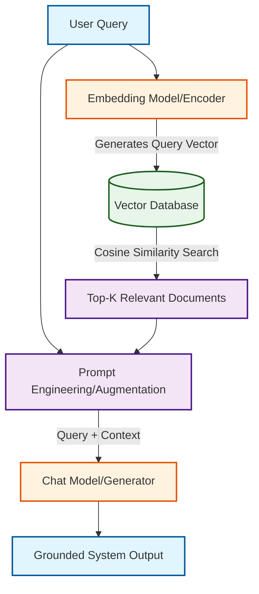

# Understanding Retrieval-Augmented Generation (RAG)

Welcome! This guide is designed for Data Science students to understand the architecture and implementation of **Retrieval-Augmented Generation (RAG)**. We will use the accompanying `rag-app-demo.py` script as a practical example of a fully local RAG pipeline.

---

## The Problem: Why RAG?
Large Language Models (LLMs) like GPT-4 or Llama 3 are powerful, but they have three major limitations:
1. **Knowledge Cutoffs:** They don't know about events that happened after they were trained.
2. **Private Data:** They cannot access your company's proprietary databases or personal files.
3. **Hallucination:** When asked about unknown topics, they may confidently invent incorrect answers.

##  The Solution: RAG
**RAG (Retrieval-Augmented Generation)** solves these issues by bridging your private data with the reasoning engine of an LLM. 
Instead of relying on the LLM's internal memory, we *retrieve* factual information from an external database and *augment* the LLM's prompt with this context before it *generates* the answer.

---

## System Architecture

Here is the flow of information in a standard RAG application:



### The Three Pillars of RAG

1. **Embedding (Ingestion):** Text documents are converted into high-dimensional numerical arrays (vectors) utilizing an embedding model (e.g., `text-embedding-3-small` or `nomic-embed-text`). These vectors map the semantic meaning of the text into a mathematical space.
2. **Retrieval:** When a user asks a question, the question is also embedded into a vector. We calculate the geometric distance (often via **Cosine Similarity**) between the question vector and the document vectors. The closest document vectors represent the most semantically relevant text.
3. **Generation:** The retrieved documents are injected into the system prompt alongside the user's original question. The LLM reads the context and generates an accurate, grounded response.

---

## Translating Theory to Code (`rag-app-demo.py`)

If you look at `rag-app-demo.py`, you'll see this exact architecture implemented in pure Python:

### 1. Vectorizing the Data (Ingestion)
Before the chat loop starts, we embed our "database" of travel documents.
```python
for doc in documents:
    response = embedding_client.embeddings.create(input=doc, model=embedding_model)
    embedding = response.data[0].embedding
    vector_db.append({"text": doc, "embedding": embedding})
```

### 2. Mathematics of Retrieval
We compute **Cosine Similarity** to compare vectors. In geometry, the cosine of the angle between two vectors determines their directional similarity. A score closer to `1.0` means the meanings are highly related.
```python
def cosine_similarity(v1, v2):
    dot_product = sum(a * b for a, b in zip(v1, v2))
    # ... calculates magnitudes and divides dot product by magnitudes
    return dot_product / (norm_v1 * norm_v2) 
```
When a question comes in, the app finds the document with the highest cosine similarity score.

### 3. Prompt Augmentation
Instead of just sending `input_text` to the LLM, we intercept it and prepend the context we just retrieved:
```python
augmented_prompt = f"Context: {best_doc}\n\nUser query: {input_text}"
```
This forces the LLM's attention mechanism to focus on the provided factual context rather than its pre-trained weights, effectively eliminating hallucinations for this query.

---

## Example Execution Trace

Let's look at a real interaction with the `rag-app-demo.py` script and break down what's happening behind the scenes.

### 1. Initialization & Ingestion
```text
Initializing RAG app Demo...
- Embedding Model: nomic-embed-text (Ollama)
- Chat Model     : llama3     (Ollama)

Generating embeddings for local data sources...
Vector database initialized successfully.
```
* **What's happening:** The script connects to the local Ollama instance and verifies the selected models. It then reads our travel documents, sends them to the `nomic-embed-text` model to generate document vectors, and stores them in our in-memory `vector_db`.

### 2. The User Query
```text
Enter the prompt (or type 'quit' to exit): do you have any travel discounts
```
* **What's happening:** The user asks a question. The script takes this exact string, sends it to the same `nomic-embed-text` model, and gets a **"Query Vector"** back.

### 3. Retrieval & Augmentation
```text
[Retrieved Context (Score: 0.64)]: We have special 15% discounts for group bookings of 5 or more people.
```
* **What's happening:** The script compares the Query Vector against all Document Vectors using Cosine Similarity. It found a match with a high semantic similarity score of `0.64`! The script then dynamically constructs a new prompt that looks like:

> Context: We have special 15% discounts for group bookings of 5 or more people.
> 
> User query: do you have any travel discounts

### 4. Generation
```text
[Response]: We definitely do! At Margie's Travel, we offer a fantastic discount on group bookings of 5 or more people. If you're traveling with a big group, we'll give you 15% off your entire trip! Just book together and mention our group discount to take advantage of this amazing deal.
```
* **What's happening:** The LLM (`llama3`) receives the augmented prompt instead of just the user's raw question. It reads the factual context provided and generates a natural, conversational response that directly uses the 15% discount rule. Hallucination is eliminated!

### Example 2: Destination Specific Query
Now let's see how RAG handles a query about a specific service we offer:
```text
Enter the prompt (or type 'quit' to exit): help me with a trip to Paris

[Retrieved Context (Score: 0.68)]: Margie's Travel offers flights to London, Paris, and Rome starting at $399.

[Response]: Paris, the City of Love! I'd be delighted to help you plan your trip!

Since you're interested in traveling to Paris, I'll assume that's where you'd like to go. We offer flights to Paris starting at just $399 per person! That's an incredible deal for a fabulous destination.

Before we get started on booking, may I ask:

* What time of year are you planning your trip? (Peak season is June-August, but prices vary depending on the month.)
* How many days would you like to stay in Paris?
* Are there any specific dates or travel requirements you have?

Once I have this information, I can provide you with a personalized quote and help you book your dream trip!
```
* **What's happening here:** The vector database finds high semantic similarity (`0.68`) with the phrase "trip to Paris" because the word "Paris" is explicitly in one of our context vectors. The LLM gets the base fact (flights to Paris start at $399) and powerfully extends it into a helpful customer service response. This beautifully illustrates how RAG pairs the rigid factual constraints of retrieval with the creative, conversational flexibility of generation!

---

## Running the Local Pipeline

### 1. Python Environment Setup

Create and activate a virtual environment, then install dependencies:

```bash
# Create the virtual environment (one-time setup)
python -m venv .venv

# Activate it
source .venv/bin/activate        # macOS / Linux
# .venv\Scripts\activate         # Windows

# Install all required libraries
pip install -r requirements.txt
```

> You only need to create the venv once. For future sessions just run `source .venv/bin/activate` before running any script.

### 2. Configure environment variables

Copy the sample file and add your OpenAI API key (only required when `USE_OLLAMA_FOR_EMBEDDINGS` or `USE_OLLAMA_FOR_CHAT` is `False`):

```bash
cp .env.sample .env
```

Then open `.env` and replace the placeholder:
```
OPEN_AI_KEY=your_openai_api_key_here
```

> ⚠️ `.env` is listed in `.gitignore` — never commit a file containing a real API key.

### 3. Start Ollama and pull models

Start the Ollama server and download the two models used by the demo:

```bash
ollama serve

# Embedding model (converts text → vectors)
ollama pull nomic-embed-text

# Chat model (generates answers from context)
ollama pull llama3
```

These match the models shown at startup:
```text
Initializing RAG app Demo...
- Embedding Model: nomic-embed-text (Ollama)
- Chat Model     : llama3     (Ollama)
```

In `rag-app-demo.py`, you can route the models to a local [Ollama](https://ollama.com/) instance, allowing you to run the entire RAG pipeline entirely offline on your laptop's GPU/CPU.

```python
# Toggles for fully local execution
USE_OLLAMA_FOR_EMBEDDINGS = True
USE_OLLAMA_FOR_CHAT = True
```

This represents the modern era of edge AI, where data privacy is maintained because your documents and queries never leave your machine!

---

## Streamlit UI Version

A browser-based chat UI version of the full RAG pipeline is available in `rag-app-streamlit.py`. It exposes every configurable option from the script as interactive sidebar controls and replaces the terminal loop with a proper chat interface.

### Running the UI

Make sure Ollama is running with the required models pulled, then:
```bash
streamlit run rag-app-streamlit.py
```
The app opens automatically at `http://localhost:8501`.

### UI Features

| Feature | Description |
|---|---|
| **Model toggles** | Switch between Ollama and OpenAI for embeddings and chat independently using sidebar toggles — no code edits needed |
| **Model dropdowns** | Choose from multiple embedding models (`nomic-embed-text`, `mxbai-embed-large`, `all-minilm`) and chat models (`llama3`, `phi3`, `mistral`, `gemma`) |
| **OpenAI API Key field** | Securely enter your OpenAI key directly in the sidebar (only needed when not using Ollama) |
| **Document Corpus panel** | All indexed documents are listed in the sidebar for easy reference |
| **Chat interface** | Full conversational UI using `st.chat_message` — multi-turn history is preserved across messages |
| **Retrieved context expander** | Every assistant reply includes a collapsible expander showing the exact document that was retrieved and its cosine similarity score |
| **Clear history button** | Resets both the display messages and the LLM's conversation memory in one click |
| **Cached vector DB** | Document embeddings are computed once (`@st.cache_resource`); switching models triggers an automatic re-build |
| **Error guidance** | If a model fails to load, a banner displays the exact `ollama pull` command needed |

### Example Chat Interaction

```
You:  do you have any travel discounts?

Assistant:  Yes! At Margie's Travel we offer a 15% discount for group bookings
            of 5 or more people. Just book together and mention the group rate!

  📎 Retrieved context (score: 0.6412)
  └─ We have special 15% discounts for group bookings of 5 or more people.

You:  what about getting to Paris?

Assistant:  Great choice! We offer flights to London, Paris, and Rome starting
            at just $399. Would you like help putting together an itinerary?

  📎 Retrieved context (score: 0.6831)
  └─ Margie's Travel offers flights to London, Paris, and Rome starting at $399.
```

> **Tip:** Notice that the second question references Paris without repeating the discount — the LLM's conversation history (maintained via `st.session_state`) means it remembers what was already discussed, just like a real customer service chat.
