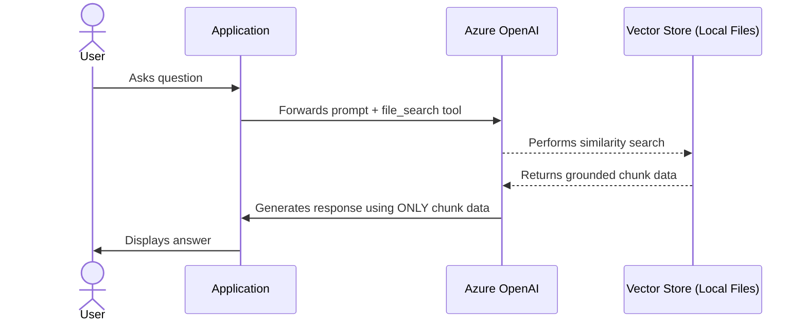
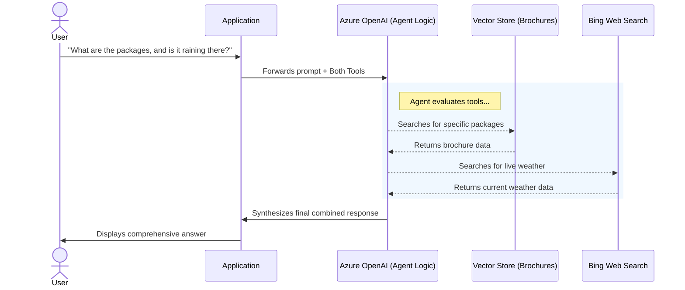

# Architectural Comparison: RAG App vs. Tools App

This document breaks down the differences between the two Retrieval-Augmented Generation (RAG) paradigms demonstrated in this repository: the **Simple RAG (`rag-app.py`)** approach and the **Agentic Multi-Tool RAG (`tools-app.py`)** approach.

---

## 1. Simple Retrieval-Augmented Generation (`rag-app`)

**Goal**: Ground the Large Language Model exclusively on a provided, private dataset.

In this architecture, the application takes a single local file (or set of files), uploads it to a vector store, and binds it to the model. When a user asks a question, the model responds *only* using the context provided by these specific documents via the `file_search` tool.

### Architecture Flow



### Key Implementation Details (`rag-app.py`)

The app uses the **Responses API** (`client.responses.create`), not the Chat Completions API. This is required for `file_search` tool support and stateful conversation threading via `previous_response_id`.

```python
response = client.responses.create(
    model=model_deployment,
    instructions="""
    You are a travel assistant for Margie's Travel.
    Answer questions ONLY using the information found in the provided travel brochures.
    If the answer cannot be found in the documents, say so clearly — do not use outside knowledge.
    """,
    input=input_text,
    previous_response_id=last_response_id,
    tools=[
        {
            "type": "file_search",
            "vector_store_ids": [vector_store.id]
        }
    ]
)
print(f"\nAI: {response.output_text}")
last_response_id = response.id
```

**Critical API differences from Chat Completions:**

| Aspect | Chat Completions (❌ wrong) | Responses API (✅ correct) |
| :--- | :--- | :--- |
| Method | `client.chat.completions.create` | `client.responses.create` |
| User input | `messages=[{"role":"user", ...}]` | `input=input_text` |
| System prompt | `messages=[{"role":"system", ...}]` | `instructions="..."` |
| Tool binding | Not supported | `tools=[{"type":"file_search", ...}]` |
| Conversation state | Manual `messages` list | `previous_response_id=last_response_id` |
| Output | `response.choices[0].message.content` | `response.output_text` |

### Example Prompts & Expected Behaviour

The brochures (`brochures/*.pdf`) are short destination overviews (~7,200 characters total across 6 files: Dubai, Las Vegas, London, New York, San Francisco, and Margie's Travel Company Info). They cover city descriptions, hotels, and services — not pricing, events, or discounts.

**Questions that return real answers (content exists in documents):**
```
What hotels does Margie's Travel offer in Dubai?
What services does Margie's Travel arrange?
Tell me about San Francisco.
```

**Questions that correctly return "not found" (content absent from documents):**
```
> group discounts
AI: The documents provided do not contain any information about group discounts.

> any events in San Francisco next week?
AI: The documents provided do not include specific information about events in San Francisco for next week.
```

These "not found" responses are **correct behaviour**, not a bug. The `file_search` tool searched the vector store and found no matching content. Because there is no `web_search_preview` tool, the model cannot fall back to the internet — which is exactly the data-boundary guarantee this architecture provides.

> **Tip — verifying the vector store:** Run the app and confirm startup output shows `Vector store created with 6 files.` Then ask a question whose answer is definitely in the brochures (e.g., *"What can Margie's Travel arrange for me?"*). A grounded answer confirms the vector store and `file_search` binding are working correctly.

### Pros & Cons

| Pros | Cons |
| :--- | :--- |
| **High Predictability**: The model is restricted to a known set of facts, drastically reducing hallucinations. | **Limited Worldview**: It cannot answer questions outside the scope of the provided documentation. |
| **Data Boundaries**: Ensures that the AI does not leak external, potentially unverified web data into enterprise answers. | **Static**: Cannot fetch real-time information (e.g., current weather, live flight statuses). |
| **Lower Cost & Latency**: The model only has to evaluate a single tool path, meaning fewer tokens are processed during reasoning. | |

---

### Variant: Streamlit UI (`rag-app-ui.py`)

`rag-app-ui.py` is a browser-based version of the same RAG architecture. It replaces the terminal `input()` loop with a full Streamlit chat interface while keeping the identical Responses API + `file_search` logic underneath.

**Run it:**

```bash
pip install -r requirements.txt
streamlit run rag-app-ui.py
```

**What's different from `rag-app.py`:**

| Concern | `rag-app.py` (CLI) | `rag-app-ui.py` (Streamlit) |
| :--- | :--- | :--- |
| Interface | Terminal `input()` / `print()` loop | `st.chat_input` / `st.chat_message` bubbles |
| Vector store init | Runs once at startup, blocks terminal | `@st.cache_resource` — runs once per session, non-blocking |
| Conversation history | Not displayed | Full history rendered in chat window |
| Conversation state | `last_response_id` local variable | `st.session_state.last_response_id` persisted across reruns |
| Reset | Restart the script | "Clear conversation" button in sidebar |
| Brochure index | Listed at startup in terminal | Sidebar shows indexed files at all times |

**Streamlit-specific patterns used:**

- `@st.cache_resource` — wraps the `OpenAI` client and vector store creation so neither is re-initialised on every Streamlit rerun (which happens on each user interaction).
- `st.session_state` — persists `messages` (the display history) and `last_response_id` (the Responses API thread pointer) across reruns.
- `st.spinner` — shows a "Searching brochures…" indicator while the API call is in flight.
- `st.sidebar` — displays vector store status, the list of indexed brochures, and the clear-conversation button.

The core call to `client.responses.create(...)` with `file_search` is **identical** to the CLI version — the Streamlit layer is purely presentational.

---

## 2. Agentic Multi-Tool RAG (`tools-app`)

**Goal**: Provide the LLM with an array of tools (internal file search + public web search) and allow it to dynamically decide which to use to fulfill the user's request.

In this architecture, the LLM acts as an intelligent "Agent". It is provided with both the private vector store (`file_search`) and a Bing integration (`web_search_preview`). Based on the user's prompt, the LLM reasons about *where* the answer is most likely to be found—sometimes querying just the brochures, sometimes just the web, and sometimes both.

### Architecture Flow



### Pros & Cons

| Pros | Cons |
| :--- | :--- |
| **High Flexibility**: Can answer complex questions requiring both private, static context and public, real-time context. | **Higher Latency**: The model must perform additional "thinking" steps to evaluate which tools to call, and wait for multiple tools to return. |
| **Dynamic Reasoning**: Less rigid prompting is required. You simply give the model the tools, and it orchestrates the execution itself. | **Higher Cost**: Tool orchestration requires sending more context/system tokens back and forth. |
| **Better User Experience**: Feels like a true intelligent assistant rather than just a document search engine. | **Risk of Misrouting**: The model might occasionally search the web for internal data if the prompt isn't clear enough. |

