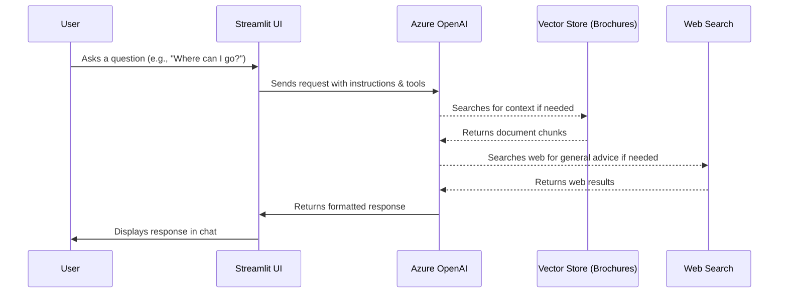

# Margie's Travel Agent - Streamlit UI

Welcome to the **Margie's Travel Assistant** UI version! This application gives life to the `tools-app.py` script by putting it into a fully interactive web application interface.

## Application Architecture

The app uses Azure OpenAI capabilities to index and answer questions about PDF travel brochures using **file search**, while supplementing general knowledge through **web search**.



## Setup & Running

1. Ensure your `.env` file is present in the `tools` folder. It must contain:
   - `AZURE_OPENAI_ENDPOINT`
   - `API_KEY`
   - `MODEL_DEPLOYMENT`
   
2. Install the necessary packages. (You might need `streamlit` if not already installed):
   ```bash
   pip install -r requirements
   ```

3. Run the Streamlit application from your terminal:
   ```bash
   streamlit run tools-app-streamlit.py
   ```

4. View the App!
   - On startup, the UI will briefly say "Generating vector store..." while it ingests the `brochures/*.pdf` files to Azure OpenAI.
   - Once loaded, check the **Left Sidebar** to verify which files were uploaded successfully.
   - Use the **Chat Interface** at the bottom to interact with the LLM using both file and web search!
